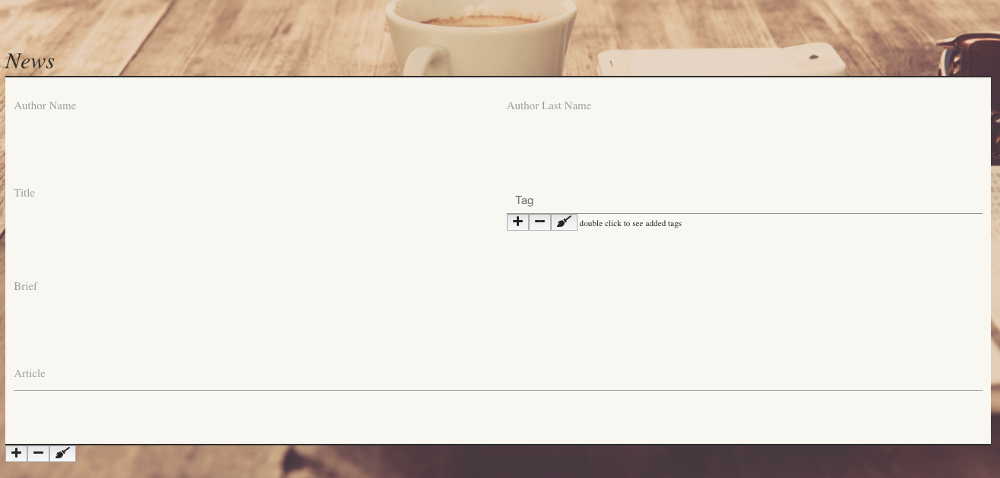

# News Management application REST APIs UI.

EPAM java spring mvc rest api curd project on April 15, 2020. 
this application is backend for simple News Management application expose REST APIs. + introduce UI layer.  

### perform the following operations:
- CRUD operations for News 
- CRUD operations for Tag.
- CRUD operations for Author.
- Get news. All request parameters are optional and can be used in conjunction. 
- Add tag/tags for news message.
- Add news author.
- Each news should have only one author.
- Each news may have more than 1 tag.

### Tools used.
Spring Boot. 
JDK version: 8. Use Streams. 
Database connection pooling: HikariCP. 
Spring JDBC Template. 
Build tool: Apache Maven 3.5+. Multi-module project. 
Web server: Apache Tomcat. 
Application container: Spring IoC. Spring Framework +. 
Spring configured via Java config. 
Database: PostgresSQL 9.+ or 10.+ 
Testing: JUnit 4.+ or 5.+, Mockito. 
Service layer covered with unit tests. 
Repository layer tested using integration tests with an in-memory embedded database. 
APIs demonstrated in Postman tool. 

### Security
stateless user authentication and verify integrity of JWT token. 
OAuth2 as an authorization protocol. 
OAuth2 scopes should be used to restrict data. 
Implicit grant and Resource owner credentials grant should be implemented. 
Implement CSRF protection. 
Implement self Signed Certificate protection. 

### Register
click on Register then enter your information. 
 

   

### Login
BY GitHub-API 
click on git icon and follow the instructions. 
 

BY User Login 
click on Login then enter username and password. 
 

 

### Home Page 
 

##### Navigation Bar 
 

##### Redirect Home
click home button. 
 

##### Search 
search it can be done by news title or by news author or both of them. 
 

reset search fields, click on reset button. 
 

##### Logout 
click on logout button. 
 

##### Goto Add/Edit News
goto Add news click on edit button and keep title and author fields empty. 
   

### Add news page
fill all the fields includes tags.  
 

##### Add one or more tag
fill tag name and click "+". 
 

##### Delete tag
double click into field choose tag which's already has been inserted and click "-". 
 

##### Add News
click "+" after filling all fields. 
 

##### Goto Edit News
first of all select title and author then click edit. 
 

select title. 
 

select author. 
 

click edit button. 
   

### Edit news page
double click into tag field to see the related tags. 
 

after doing the need it updates, click "+" to update. 
 

##### Delete news
attention !!! delete allow only for admin users. 
 

##### Reset Buttons
 

### iPad Version
 

### mobile Version
 

